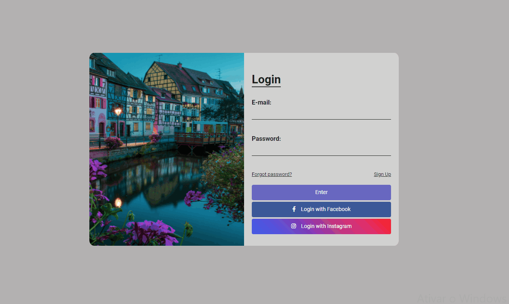

## Tela de Login - Layout
### Desenvolvido com HTML, CSS.

    
    

### Vídeo ensinando detalhadamente como desenvolver esse projeto:
https://youtu.be/EjqN2jk2Nyc

### Neste projeto criada uma tela de login.

### Durante a criação deste projeto, pude desenvolver meus conhecimentos com centralização de itens, criação de botões interativos, hover, possicionamento de imagens entre outros.

 
    

